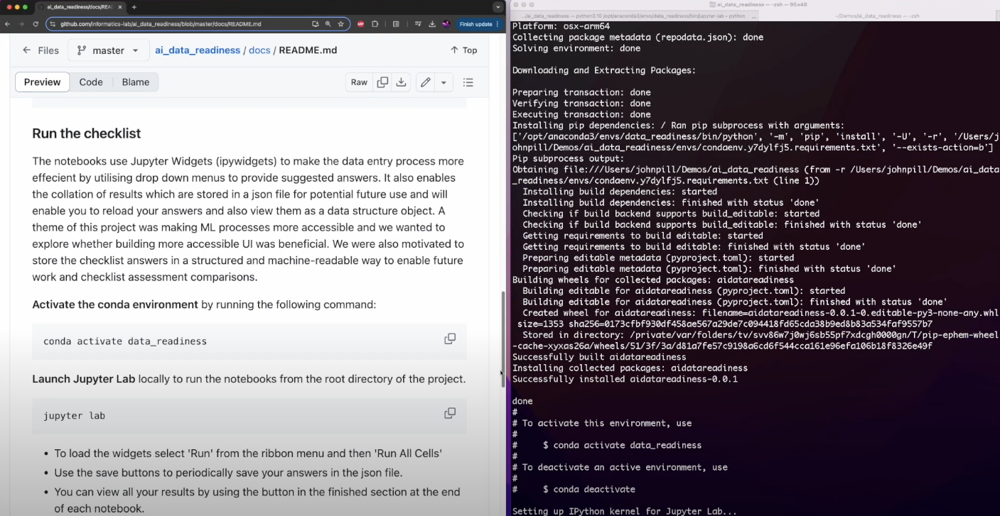

# AI Data Readiness Checklist


## **Overview**

### Checklist origin
The checklist is developed using the 2019 draft readiness matrix developed by the Office of Science and Technology Policy Subcommittee on Open Science as a basis. This checklist is developed through a collaboration of ESIP Data Readiness Cluster members include representatives from NOAA, NASA, USGS, and other organizations. 

ESIP Data Readiness Cluster (2023): Checklist to Examine AI-readiness for Open Environmental Datasets v.1.0. ESIP. Online resource. https://doi.org/10.6084/m9.figshare.19983722.v1

Readiness Matrix (2020): What is AI-Ready Open Data? NOAA. Online resource. https://www.star.nesdis.noaa.gov/star/documents/meetings/2020AI/presentations/202010/20201022_Christensen.pdf

### Why assessing dataset readiness for AI is important:
1.	**Ensures Data Usability:** Weather and climate datasets can be complex, with variations in formats, resolutions, temporal frequencies, and spatial coverage. Assessing datasets ensures that they are in a usable format for machine learning models. For example, raw weather station data might have missing timestamps, outlier values, instrument bias or inconsistent units that need to be standardized before being useful for ML.
3.	**Facilitates Better Model Training:** The quality of ML models heavily depends on the quality of data (garbage in -> garbage out). Issues like incomplete, noisy, or biased datasets can lead to poor model performance and unreliable predictions.
4.	**Saves Time and Resources:** By identifying data readiness issues early you can consider the best datasets for your problem and focus on fixing these issues rather than discovering them late in the project. This proactive approach prevents wasted effort on training models with flawed data.
5.	**Supports Reproducibility and Scalability:** Ensuring that datasets are well-documented and accessible promotes reproducibility of results and makes it easier to scale solutions for broader applications.
6.	**Addresses Domain-Specific Challenges:** Weather data often has unique challenges, such as:
    * Temporal dependencies: Weather phenomena are time-sensitive, so gaps in data timestamps can severely impact model accuracy.
    * Spatial resolution: High-resolution data might be necessary for localized weather predictions.
    * Heterogeneity: Weather datasets often combine different sources (e.g., satellite images, sensor readings, and reanalysis data) that need integrating for interoperability.
    * A data readiness assessment identifies these domain-specific issues so you can consider how to mitigate them, paving the way for effective ML models.
7.	**Promotes Ethical and Responsible AI:** Assessing dataset readiness includes checking for biases or limitations in the data, which helps avoid unintentional harm or inaccuracies in predictions.
Ethical AI systems should be transparent about their data sources and limitations. If a weather dataset has known issues (e.g., gaps in temporal coverage or missing metadata), these should be documented. This transparency allows users to interpret the model’s predictions responsibly, avoiding over-reliance on potentially flawed outputs.


### Prerequisits
Ideally for AI-ready assessment, a dataset should be defined as the minimum measurable bundle (i.e., a physical parameter/variable of observational datasets or model simulations). The assessment at this scale will enable better integration of data from different sources for research and development. However, it can be an intensive process for manual assessment without automation. Therefore, we recommend current assessments be done on the data file level. If the dataset has different versions, the checklist should be applied to each dataset type (e.g. raw, derived).

### Checklist sections
The checklist is broken up into 5 sections contained in 4 notebooks (part 1 & 2 are combined). 
* Part 1 - General Info
* Part 2 - Data Quality
* Part 3 - Data Documentation
* Part 4 - Data Access
* Part 5 - Data Preparation

### Checklist versions
This repository contains a checklist which will help you identify if your dataset is ready for machine learning model ingestion. There are different versions of the checklist:
* [Checklist Template Gridded Data Tutorial](https://github.com/informatics-lab/ai_data_readiness/tree/master/Checklist%20Template%20Gridded%20Data%20Tutorial) - a version of the template specifically tailored for gridded datasets.
* [Checklist Template Tabular Data Tutorial](https://github.com/informatics-lab/ai_data_readiness/tree/master/Checklist%20Template%20Tabular%20Data%20Tutorial) - a version of the template specifically tailored for tabular datasets. 
* [Checklist Template](https://github.com/informatics-lab/ai_data_readiness/tree/master/Checklist%20Template) - a generic blank version of the template

## **Setup**

Here is a short video to guide you through the setup process: <br>
<p align="center">
  <a href="https://www.youtube.com/watch?v=NYK4KkcuXGo">
    
  </a>
</p>

### Clone the repository

```bash
git clone git@github.com:informatics-lab/ai_data_readiness.git 
```

### Create an environment 

Use [Conda](https://www.anaconda.com/download) to create environments for running the Jupyter Notebooks and Python scripts. All of the YAML files to create the Conda environments are stored in the env/ directory. 
Change directory to the new ai_data_readiness folder

```bash
cd ai_data_readiness
``` 

**Use the commands below in the root directory of the project** to create the ```data_readiness``` conda environment for the checklist notebooks.

```bash
chmod +x setup.sh
./setup.sh
```

### Run the checklist
The notebooks use Jupyter Widgets (ipywidgets) to make the data entry process more effecient by utilising drop down menus to provide suggested answers. It also enables the collation of results which are stored in a json file for potential future use and will enable you to reload your answers and also view them as a data structure object. A theme of this project was making ML processes more accessible and we wanted to explore whether building more accessible UI was beneficial. We were also motivated to store the checklist answers in a structured and machine-readable way to enable future work and checklist assessment comparisons. 

**Activate the conda environment** by running the following command:
```bash
conda activate data_readiness
```

**Launch Jupyter Lab** locally to run the notebooks from the root directory of the project. 

```bash
jupyter lab
```

* To load the widgets select 'Run' from the ribbon menu and then 'Run All Cells'
* Use the save buttons to periodically save your answers in the json file.
* You can view all your results by using the button in the finished section at the end of each notebook.

## Assess a dataset with the checklist

Use the links below for docs relating to the specific versions of the checklist and guidance on how to start assessing your first dataset:
* [Tabular Checklist Docs](https://github.com/informatics-lab/ai_data_readiness/blob/master/docs/tabular_checklist_docs.md)
* Gridded Checklist - need to finish. 


## **Examples**
We have completed the checklist with a variety of datasets to demonstrate how to use it. 
Whilst completing the questions is important, we are also using the notebooks to evidence the process used to discover the answers. Such as how to identify outliers, null values etc.
Some of the completed checklist folders include simple example machine learning (ML) projects to demonstrate how the datasets could be used. You could use these as a starting point for your own ML exploration or try and improve the example project performance. 

| Dataset | Organization | Data Summary | Machine Learning Summary | Environment Directory | 
| - | - | - | - | - |
| ERA5 | ECMWF | Global Geospatial Gridded Climate Reanalysis | Autoencoder | era5_requirements.yml |
| Global Summary of the Day | NOAA | Daiky global weather station observations | XGBoost, LSTM  | gsod_xgboost_requirements.yml, gsod_lstm_requirements.yml |
| HadCRUT5 | Met Office | Global temperature anomaly data for climate monitoring | XGBoost, CNN | hadcrut5_requirements.yml |
| HadUK-Grid | Met Office | Gridded UK climate data for temperature and precipitation | CNN | haduk_grid_requirements.yml |
| GOES Satellite Imagery | NOAA | Real-time satellite imagery for weather monitoring | ConvLSTM | goes-satellite-image-requirements.yml |

## **Dataset Suggestions**
Find suggested datasets here: [datasets.md](./datasets.md)
