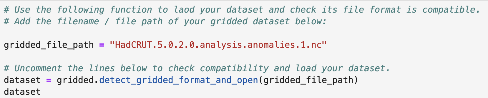

# Gridded Checklist Docs

## Setup
* Ensure you have set up and activated the checklist_requirements.yml environment as explained on the project readme.
* Run the notebooks locally using Jupyter Lab.
___

Here is a short video to guide you through using the gridded notebook checklist: <br>
<p align="center">
  <a href="[https://youtu.be/RWZfME0q6b8](https://youtu.be/RWZfME0q6b8)">
    
  </a>
</p>

### Hidden widget code
We have used ipywidgets to create data entry fields for the checklist questions to make the process more accessible. <br>

The code to generate these is contained in the hidden cells with ... ellipses. 


You can open these by clicking on the ... if you wish to review the code. To close them click the blue bar on the left. 

___

### Save your answers.

Use the save buttons placed throuhgout the notebooks to save each section. This will save your answers to the .json file. 


___

### Print your results.

At the end of each notebook you will find a print json results button that will enable you to review your stored results.  
<br>


___


## Helper functions to support template completion. 
There are a range of functions used throughout the tabular checklist notebook to help you investigate your dataset and find the appropriate answers. 
These functions are stored in the project utils.py file.

Review the function doc strings for more information on what they do and how to use them. 


## Examples of how to use the checklist code:


### Load data
We have provided a ```detect_gridded_format_and_open()``` function which can load a variety of different gridded file formats into an Xarray Dataset. <br>


___


### Basic Details
Throughout the checklist we have provided a range of approaches to help you answer the questions. For instance in the Basic Details secion we can access some information from the dataset to help answer some of the questions: <br>


___


### Data Completeness
Here is an example where we call a range of functions to help answer questions relating to data completeness. This information might be useful in collabouration with the dataset documentation to decide how complete the dataset is. <br>


___


### Data Consistency
Here is an example where we call a range of functions to help answer questions relating to data consistency. This information might be useful in collabouration with the dataset documentation to decide how consistent the dataset is. <br>

___


## Checklist Completion:
* Work through the 4 Jupyter notebooks using the code examples to help you explore the dataset.
* Record your answers using the widget data entry form elements and use the buttons to save your information to .json as you work through.
* Evidence your data exploration using the notebook to demonstrate how you found the answers (see examples in the examples folder).
* Consider the value of assessing a dataset and the importance of the process in determining if a dataset is AI ready. 
___


