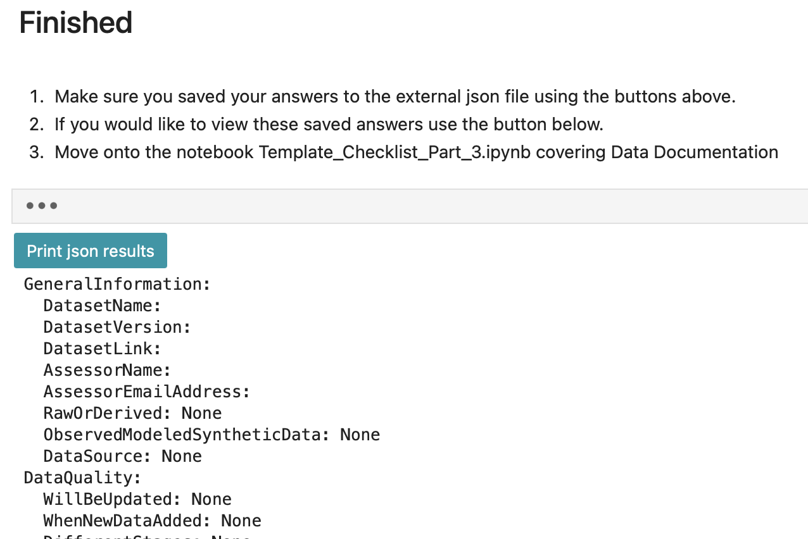
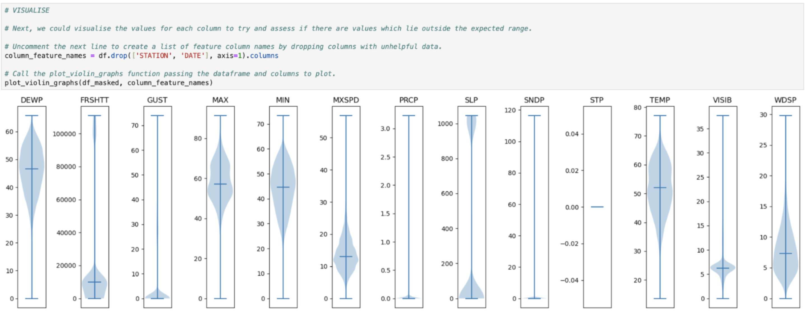

# Tabular Checklist Docs

## Setup
* Ensure you have set up and activated the checklist_requirements.yml environment as explained on the project readme.
* Run the notebooks locally using Jupyter Lab.
___

Here is a short video to guide you through using the tabular notebook checklist: <br>
<p align="center">
  <a href="https://youtu.be/TJd8kijuTqo">
    
  </a>
</p>

### Hidden widget code
We have used ipywidgets to create data entry fields for the checklist questions to make the process more accessible. <br>

The code to generate these is contained in the hidden cells with ... ellipses. 


You can open these by clicking on the ... if you wish to review the code. To close them click the blue bar on the left. 

___

### Save your answers.

Use the save buttons placed throuhgout the notebooks to save each section. This will save your answers to the .json file. 


___

### Print your results.

At the end of each notebook you will find a print json results button that will enable you to review your stored results.  
<br>


___


## Helper functions to support template completion. 
There are a range of functions used throughout the tabular checklist notebook to help you investigate your dataset and find the appropriate answers. 
These functions are stored in the project utils.py file.

Review the function doc strings for more information on what they do and how to use them. 


## Notebook part 1 & 2:


### Load data
We have provided a ```read_file()``` function which can load a variety of different tabular file formats into a Pandas DataFrame.

___


### Expected spatial coverage
The ```check_spatial_coverage()``` function can review the expected latitude and longitude and inform you if any points in the tabular dataset are outside the bounds expected. 


___

### Expected temporarl coverage
The ```check_temporal_coverage()``` function can review the expected time period and time frequency and inform you if there are missing dates. 

___


### Dataset size
The ```csv_size_info()``` function demonstrates how you could investigate the size of a tabular dataset file, and its size in memory.

___


## Notebook part 5:


### Null values
The ```null_percent()``` function presents the null values as a new DataFrame with the count and percentage. 


Many datasets have missing values which been assigned an arbitary value to represent a missing value such as 99.99, 999.9, 9999.9 etc. The ```mask_values()``` function will enable you to pass an array of these values and replace them will np.nan or some other value such as 0. <br>
We can then run the ```null_percent()``` function again to review the missing values properly. 


___


### Outliers
The ```.describe()``` method is very useful for gaining a general understanding of key data statistics such as the mean, min and max which might give you an initial suspicion if any values might be outliers. 


It can be helpful to visualise your data to check for outliers. Here is an example idea using a function called ```plot_violin_samples()```



Calculating Z-Scores can also be useful when looking for outliers.The ```print_z_scores()``` function can help you analyse the chance of containing outliers.


